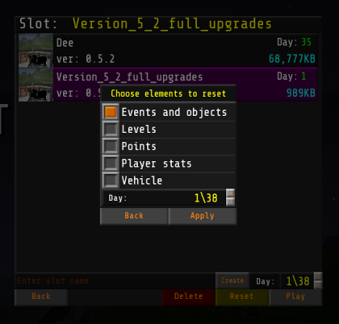

# Voices Of The Void

*14.05.2023 (dd/mm/yyyy)*

Here you can download my VOTV save file with full workstation upgrades. And bonus 1,183 credits. 
Just download this repository, extract the 's_Version_5_2_full_upgrades.sav' file and put it to the save directory in: `C:\Users\User_Name\AppData\Local\VotV\Saved\SaveGames` (The '`User_Name`' being your computer name) 
You can change the name of the file, but make sure the file has 's_' before your desired name. Or it will not work.

Note that, the save file was created in version 0.5.1_2 and was reset 2 times in version 0.5.2. 
I can't guarantee it will work in future versions, since MrDrNose is working on big changes in d06. 
EDIT 15.7.2023 (dd/mm/yyyy): Yes, it still works in version demo 0.6.0

When you boot up the game, Don't forget to reset days, events and objects. I made sure to do it before upload, but you should do it too.

## [VOTV](https://mrdrnose.itch.io/votv)
